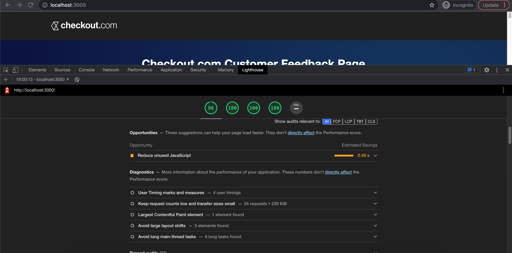

# Checkout.com Frontend Challenge

## How to Install

Use `npm install` to install dependencies.

## How to Use

Use `npm run dev` for the dev version of the app.

Use `npm run build` and `npm run start` will create a production ready version of the code and start the server with this version.

Use `npm run test:watch` for running the test suite.

## Choices

- `Chart.js` and `react-chartjs-2` are used for the graph bars on the App, this was chosen after shopping for a while for chart libraries (as the last one I used was d3 about 7 years ago so...), this seemed easy enough to use and very customizable.

- `JSON Server` was used to abstract from the fact that an API was not provided, this library creates a fake API that provides CRUD operations over a local JSON file. This file called `reviews.json` has been filled with some mock reviews, but it could be emptied to see how the app behaves when no reviews are provided.

- `react-rating-stars-component` is used for both the ratings in the create a review and the ratings shown in the chart homepage.

- `react-toast-notifications` to provide toast notifications for the user.

- `simple-git-hooks` to run tests before pushing to the repo.

Everything else used is run of the mill libraries widely used on React development (`Formik`, `Axios`, `Nextjs`, `testing-library`, `eslint`).

## Web Standards

I aimed at 100 points at SEO, Accessibility and Good Practices.

## What's left to do?

- Improve test coverage, especially around the usage of Chart.js, because sadly I couldn't make it play nice with the testing library.

- Add pagination to the reviews as it can get unwieldy after 10+ reviews.

- Add server side rendering for the site and/or serve cached versions of the page.

- Improve the tree shaking for the unused JavaScript for those last points for a 100/100 performance score.

## Features

The ratings overview was ~copied~ inspired by Amazon's product rating system. This means the bars are fully clickable and they will filter the reviews shown alongside the chart on the landing page. This also contains a count of the total ratings and the average score of the product as seen here.

